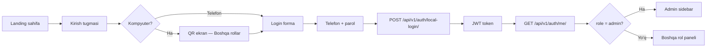
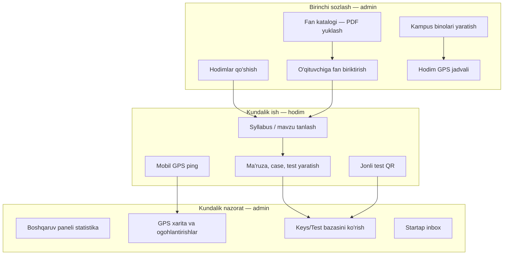

# iMentor — Administrator paneli qo‘llanmasi

Bu hujjat **SPA ichidagi administrator paneli** uchun yozilgan — ya’ni `admin` roli bilan tizimga kirgandan keyin chap menyuda ko‘rinadigan **Boshqaruv paneli**, **Hodimlar**, **GPS** va boshqa modullar.

> **Farqni bilish muhim:** loyihada ikkita “admin” bor:
>
> | Interfeys | URL | Kim uchun |
> |-----------|-----|-----------|
> | **iMentor admin paneli (SPA)** | `https://imentor.uz` → login → sidebar | Kundalik nazorat: hodimlar, GPS, katalog, bazalar |
> | **Django Jazzmin admin** | `https://imentor.uz/admin/` | Texnik: DB jadvalari, migratsiya, qo‘lda model tahriri |

Kundalik ish uchun **SPA panel** yetarli. `/admin/` faqat chuqur texnik vazifalar uchun.

---

## Mundarija

1. [Administrator kim va nima qiladi](#1-administrator-kim-va-nima-qiladi)
2. [Kirish — qanday login qilish](#2-kirish--qanday-login-qilish)
3. [Panel tuzilishi va navigatsiya](#3-panel-tuzilishi-va-navigatsiya)
4. [To‘liq ish oqimi (flow)](#4-to‘liq-ish-oqimi-flow)
5. [Modullar bo‘yicha batafsil](#5-modullar-bo‘yicha-batafsil)
6. [Test qilish — checklist](#6-test-qilish--checklist)
7. [API va fayl manbalari](#7-api-va-fayl-manbalari)
8. [Muhit o‘zgaruvchilari](#8-muhit-ozgaruvchilari)
9. [Tez-tez uchraydigan savollar](#9-tez-tez-uchraydigan-savollar)

---

## 1. Administrator kim va nima qiladi

### Rol

- Backendda foydalanuvchi Django **`admin` guruhi**da bo‘lishi kerak (yoki `is_superuser=True`).
- Frontend `/api/v1/auth/me/` dan `role: "admin"` olganda sidebar admin menyusini ochadi.
- **Admin dars o‘tkazmaydi** — ma’ruza, case, test yaratish **hodim** hisobida qilinadi. Admin **nazoratchi va menejer**.

### Admin nima qiladi

| Vazifa | Qayerda |
|--------|---------|
| Foydalanuvchilarni yaratish, tahrirlash, o‘chirish | Hodimlar |
| Kampus binolarini va GPS radiuslarini sozlash | Kampus binolari |
| Hodim dars jadvali + joylashuv nazorati | Joylashuv (GPS) |
| Markaziy fan katalogi (PDF, mavzular) | Fan katalogi |
| Hodim yaratgan keys/testlarni ko‘rish va o‘chirish | Keys / Test bazasi |
| Yuborilgan startap arizalarini ko‘rish | Startap arizalar |
| Umumiy statistika | Boshqaruv paneli |

### Admin nima qilmaydi (hodimga tegishli)

- Syllabus bo‘yicha dars kontenti yaratish
- AI orqali case/test generatsiya
- Talabalar uchun jonli test QR chiqarish
- O‘z telefonidan GPS ping yuborish (admin GPS yubormaydi)

---

## 2. Kirish — qanday login qilish

### Production (asosiy yo‘l)



**Qadamlar:**

1. Brauzerda ilovani oching (`https://imentor.uz` yoki dev: `http://localhost:8080`).
2. **Kirish** tugmasini bosing.
3. **Kompyuterda** avval hodim QR ekrani chiqishi mumkin — pastda **«Boshqa rollar»** (yoki shunga o‘xshash) tugmasini bosing.
4. Telefon raqam (`+998 90 …`) va parolni kiriting.
5. Muvaffaqiyatli kirishdan keyin chap tomonda **8 ta admin modul** + **Profil** ko‘rinadi.

### Bootstrap admin (server birinchi marta ishga tushganda)

Docker `migrate` / `backend` konteyneri ishga tushganda avtomatik:

```bash
python manage.py ensure_phone_superuser
```

| O‘zgaruvchi | Ma’nosi | Default |
|-------------|---------|---------|
| `ADMIN_PHONE` | Superuser telefoni | `998907863888` |
| `ADMIN_PASSWORD` | Parol | **Majburiy** — bo‘lmasa skip qilinadi |

Bu hisob ham SPA, ham `/admin/` (Django) uchun ishlaydi.

### Dev demo hisoblar (`DEBUG=True`)

Backend avtomatik yaratadi (`ensure_demo_role_users`):

| Rol | Telefon | Parol |
|-----|---------|-------|
| **admin** | `998900000001` | `Demo12345!` |
| klinika_admin | `998900000002` | `Demo12345!` |
| hodim | `998900000003` | `Demo12345!` |
| startuper | `998900000004` | `Demo12345!` |

Frontend demo tugmalari (faqat dev yoki `VITE_ENABLE_DEMO_AUTH=true`):

| O‘zgaruvchi | Tavsif |
|-------------|--------|
| `VITE_DEMO_ADMIN_PHONE` | Demo admin telefoni |
| `VITE_DEMO_ADMIN_PASSWORD` | Demo admin paroli (min 6 belgi) |

---

## 3. Panel tuzilishi va navigatsiya

Chap sidebar tartibi (yuqoridan pastga):

| # | Menyu (O‘zbek) | View ID | Komponent |
|---|----------------|---------|-----------|
| 1 | Boshqaruv paneli | `admin-dashboard` | `AdminDashboardHome.tsx` |
| 2 | Hodimlar | `admin-staff` | `AdminStaffManagement.tsx` |
| 3 | Joylashuv (GPS) | `admin-staff-location` | `AdminStaffLocationConsole.tsx` |
| 4 | Kampus binolari | `admin-campus-buildings` | `AdminCampusBuildingsPage.tsx` |
| 5 | Startap arizalar | `admin-startups` | `AdminStartupInbox.tsx` |
| 6 | Fan katalogi | `admin-syllabuses` | `AdminSyllabusCatalog.tsx` |
| 7 | Keys bazasi | `admin-cases` | `AdminCasesLibrary.tsx` |
| 8 | Test bazasi | `admin-tests` | `AdminTestsLibrary.tsx` |
| 9 | Profil | `profile` | `UserProfile.tsx` |

**Kod manbai:** `frontend/src/App.tsx` — `ADMIN_NAV_IDS` massivi.

Kirishdan keyin birinchi ochiladigan sahifa: **Boshqaruv paneli**.

---

## 4. To‘liq ish oqimi (flow)

Quyidagi diagramma **institutni ishga tushirish** va **kundalik nazorat** tartibini ko‘rsatadi.



### Mantiqiy ketma-ketlik (yangi institut)

1. **Kampus binolari** — GPS uchun geofence nuqtalari.
2. **Hodimlar** — o‘qituvchi va startuper hisoblari.
3. **Fan katalogi** — markaziy PDF + AI mavzu ajratish.
4. O‘qituvchiga **fan biriktirish** (Fan katalogi ichida).
5. **Joylashuv (GPS)** — har hodim uchun dars jadvali (kun, vaqt, bino).
6. Hodimlar tizimga kirib dars kontenti yaratadi.
7. Admin **bazalar** va **GPS** orqali nazorat qiladi.

---

## 5. Modullar bo‘yicha batafsil

### 5.1 Boshqaruv paneli

**Maqsad:** Tez nazar — tizim holati.

**Ko‘rsatkichlar (serverdan, real vaqt):**

| Kartochka | Manba |
|-----------|-------|
| Ro‘yxatdan o‘tgan foydalanuvchilar | `GET /api/v1/admin/staff/` |
| Keys yozuvlari | `GET /api/v1/admin/content-catalog/?kind=case` |
| Test yozuvlari | `GET /api/v1/admin/content-catalog/?kind=test` |
| Bugungi kirishlar | Staff ro‘yxatidagi `last_login` bugungi sana |

**Amallar:** **Yangilash** tugmasi — statistikani qayta yuklaydi.

**Eslatma:** Admin bu yerda kontent **yaratmaydi** — faqat sonlarni ko‘radi.

---

### 5.2 Hodimlar

**Maqsad:** Barcha tizim foydalanuvchilarini boshqarish.

**API:**

| Amal | Endpoint |
|------|----------|
| Ro‘yxat | `GET /api/v1/admin/staff/` |
| Yaratish / yangilash | `POST /api/v1/auth/admin-provision-staff/` |
| O‘chirish | `POST /api/v1/auth/admin-deprovision-staff/` |

**Yangi hodim qo‘shish:**

1. **Hodim qo‘shish** tugmasi.
2. To‘ldiring: telefon, parol (≥6), ism, familiya, fakultet/kafedra (ixtiyoriy).
3. **Rol** tanlang:
   - `hodim` — o‘qituvchi (ta’lim modullari)
   - `startuper` — innovatsiya moduli
   - `admin` — faqat `DEMO_ADMIN_PHONES` ro‘yxatidagi telefonlarga beriladi (prod xavfsizlik)
4. Startuper + **talaba** → **o‘quv guruhi** majburiy.
5. Startuper + **xodim** → **lavozim** majburiy.
6. **Saqlash**.

**Cheklovlar:**

- O‘zingizni o‘chira olmaysiz.
- Yagona adminni o‘chirib yoki rolini olib bo‘lmaydi.
- Telefon allaqachon band bo‘lsa xato chiqadi.

**Test uchun:** yangi hodim yarating → hodim hisobi bilan chiqib login qiling → syllabus ko‘rinishini tekshiring.

---

### 5.3 Kampus binolari

**Maqsad:** GPS geofence markazlari — dars qayerda o‘tishi kerak.

**API:** `GET/POST /api/v1/admin/campus-buildings/`, `PATCH/DELETE .../<id>/`

**Maydonlar:**

| Maydon | Ma’nosi |
|--------|---------|
| Nomi | Masalan: «Anatomiya korpusi» |
| Qisqa kod | `AK1` |
| Latitude / Longitude | Default ~ Farg‘ona (40.386, 71.786) |
| Radius (m) | Odatda 80–150 m |
| Tartib | Ro‘yxatda ko‘rinish tartibi |
| Faol | Nofaol binolar jadvalda tanlanmaydi |

**Muhim:** GPS jadval slotlari binoga bog‘lanadi. Bino o‘chirishdan oldin unga bog‘langan jadval yo‘qligini tekshiring.

---

### 5.4 Joylashuv (GPS)

**Maqsad:** Hodim dars vaqtida kampusda ekanini nazorat qilish.

**4 ta tab:**

| Tab | Vazifa |
|-----|--------|
| **Jadval** | Hodim uchun hafta kuni + vaqt + bino |
| **Jonli xarita** | So‘nggi GPS nuqtalar (Leaflet, ~5 s yangilanadi) |
| **Pinglar** | Tarix — barcha kelgan nuqtalar |
| **Ogohlantirishlar** | Radiusdan tashqarida yoki jadvalga mos kelmasa alert |

**Jadval sozlash:**

1. Yuqoridan **hodim** tanlang (telefon `998…`).
2. **Hafta rejimi:**
   - `Har hafta` — doimiy jadval
   - `Yuqori hafta` / `Pastki hafta` — ISO toq/juft hafta (alternativ jadval)
3. Har kun uchun: **boshlash–tugash vaqti**, **bino** tanlash.
4. **Saqlash** — `POST /api/v1/admin/staff-schedule/bulk/` orqali butun hafta yoziladi.

**Hodim tomonda (test uchun):**

- Faqat **mobil** qurilma (`client_kind` desktop bo‘lsa rad etiladi).
- `POST /api/v1/staff/location-ping/` — latitude, longitude, accuracy_m.

**Ogohlantirish qachon chiqadi:**

- Dars vaqti aktiv slot bor, lekin hodim bino radiusidan tashqarida.
- GPS aniqligi juda yomon bo‘lsa (≥150 m) alert yuborilmaydi — soxta signal oldini olish.

**Tavsiya etilgan test:**

1. Bino yarating (radius 80 m).
2. Hodimga bugungi kun uchun 00:00–23:59 slot bering.
3. Hodim telefonidan ping yuboring (yoki API orqali).
4. **Jonli xarita** va **Ogohlantirishlar** tablarini tekshiring.

---

### 5.5 Fan katalogi

**Maqsad:** Barcha o‘qituvchilar uchun **markaziy fan ro‘yxati** (syllabus PDF).

**API:**

| Amal | Endpoint |
|------|----------|
| Fan CRUD | `/api/v1/admin/course-syllabuses/` |
| O‘qituvchi–fan biriktirish | `/api/v1/admin/staff-course-selections/` |

**Yangi fan qo‘shish:**

1. **Fan qo‘shish** — nom, tavsif, til (uz/en/ru).
2. PDF yuklash → AI mavzularni ajratadi → **preview** → tasdiqlash.
3. Bir fanda bir nechta **variant** bo‘lishi mumkin (masalan: PI, DI, TPI yo‘nalishlari).
4. **Faol/nofaol** — nofaol fanlar o‘qituvchi katalogida ko‘rinmaydi.

**O‘qituvchiga biriktirish:**

1. Fan qatorida **o‘qituvchi biriktirish**.
2. Telefon raqamini kiriting (ro‘yxatdan o‘tgan hodim).
3. Ko‘p variantli fanda **variant** tanlash shart.

**Hodim tomonda:** `Fan tanlash` → katalogdan fan → syllabus mavzulari ochiladi.

---

### 5.6 Keys bazasi va Test bazasi

**Maqsad:** Hodimlar yaratgan materiallarni markaziy nazorat.

**API:** `GET /api/v1/admin/content-catalog/?kind=case|test`

| Kim | Kechikish |
|-----|-----------|
| Hodim o‘z kutubxonasida | ~1 soatdan keyin ko‘rinadi |
| Admin | **Darhol** ko‘radi |
| Ochiq jamoatchilik katalogi | Faqat admin tasdiqlagan/e’lon qilinganlar |

**Admin amallari:**

- Ro‘yxatdan tafsilotni ochish
- Keraksiz materialni **o‘chirish** (`DELETE /api/v1/admin/content-catalog/<id>/`)

**Test:** hodim hisobida case yarating → admin **Keys bazasi**da darhol paydo bo‘lishini tekshiring.

**Admin statistika API:**

```
GET /api/v1/admin/content-catalog/stats/?kind=test
```

Fan, yo‘nalish, mavzu va muallif bo‘yicha hisobot (JWT admin).

**Tashqi hamkor API (X-Api-Key):**

Hamkor servislar katalog (kafedra/fan nomlari) va testlarni o‘qishi uchun. JWT kerak emas.

**Katalog** (syllabus tuzilmasi, savolsiz):

```
GET /api/v1/external/catalog/stats/
GET /api/v1/external/catalog/departments/
GET /api/v1/external/catalog/departments/<department_code>/
GET /api/v1/external/catalog/subjects/
GET /api/v1/external/catalog/subjects/<subject_code>/
```

**Testlar** (hodim yaratgan savollar):

```
GET /api/v1/external/tests/stats/
GET /api/v1/external/tests/
GET /api/v1/external/tests/<id>/?question_limit=20&language=ru
GET /api/v1/external/questions/sample/?subject_code=...&count=20
```

- Kafedra va fan **nomlari** (`department_name`, `subject_name`) barcha javoblarda
- Savollar soni: **10–30** (platforma bilan bir xil)
- Sample: har savol avtomatik `languages.uz` / `.ru` / `.en` (til param shart emas)
- Detail: ixtiyoriy `?language=uz|ru|en`
- Yangi testlar darhol e’lon qilinadi (`PUBLISH_DELAY=0`)

Server `.env`:

```
IMENTOR_EXTERNAL_API_KEYS=hamkor-kalit-1,hamkor-kalit-2
```

To‘liq partner hujjati: [EXTERNAL_TESTS_API.md](EXTERNAL_TESTS_API.md)

---

### 5.7 Startap arizalar

**Maqsad:** Startuperlar yuborgan loyihalarni ko‘rish.

**API:** `GET /api/v1/startup-applications/admin/inbox/`

**Ko‘rinadiganlar:** `status=submitted` — ya’ni startuper **yuborgan** arizalar.

**Panelda:** loyiha nomi, muallif, AI tahlil, dossier ma’lumotlari.

**Test:** startuper hisobida loyiha yarating va yuboring → admin inboxda ko‘rinishi kerak.

---

### 5.8 Profil

Barcha rollar uchun umumiy: ism, parol o‘zgartirish, avatar yuklash (`/api/v1/auth/me/avatar/`).

---

### 5.9 Klinika guruhlari (hozircha faqat API)

Backend tayyor, lekin **SPA da admin UI yo‘q**.

Boshqarish:

- Swagger: `/api/docs/` → `admin/clinical-groups`
- Yoki Django `/admin/` → ClinicalGroup modellari

| Endpoint | Vazifa |
|----------|--------|
| `POST /api/v1/admin/clinical-groups/` | Klinika yaratish |
| `POST .../assign-admin/` | `klinika_admin` tayinlash |
| `GET /api/v1/clinic-admin/dashboard/` | Klinika admini dashboard (alohida rol) |

---

## 6. Test qilish — checklist

Quyidagi ro‘yxatni bosqichma-bosqich bajaring — admin panel to‘liq ishlashini tasdiqlaysiz.

### Kirish va ruxsat

- [ ] Admin telefon + parol bilan kirish
- [ ] Sidebar 8 modul + Profil ko‘rinadi
- [ ] `/api/v1/auth/me/` → `role: "admin"`
- [ ] Hodim hisobi bilan kirganda admin menyusi **ko‘rinmasligi**

### Boshqaruv paneli

- [ ] 4 ta statistik kartochka yuklanadi
- [ ] Yangilash tugmasi ishlaydi

### Hodimlar

- [ ] Ro‘yxat yuklanadi
- [ ] Yangi hodim qo‘shish
- [ ] Tahrirlash (ism, rol)
- [ ] Test hodimini o‘chirish
- [ ] O‘zini o‘chirishga urinish — xato

### Kampus + GPS

- [ ] Yangi bino yaratish
- [ ] Hodim uchun jadval slot qo‘shish
- [ ] Hodim mobil ping → jonli xaritada nuqta
- [ ] Radiusdan tashqari ping → ogohlantirish

### Fan katalogi

- [ ] Fan + PDF yuklash
- [ ] O‘qituvchiga biriktirish
- [ ] Hodim hisobida fan katalogida ko‘rinishi

### Kontent bazalari

- [ ] Hodim case yaratadi → admin Keys bazasida
- [ ] Hodim test yaratadi → admin Test bazasida
- [ ] Admin o‘chirish ishlaydi

### Startap

- [ ] Startuper ariza yuboradi → admin inbox

### Xavfsizlik

- [ ] JWT muddati tugasa — qayta login
- [ ] Admin bo‘lmagan token bilan `/api/v1/admin/*` → 403

---

## 7. API va fayl manbalari

### Backend

| Fayl | Mazmun |
|------|--------|
| `backend/core/permissions.py` | `IsAdminRole`, rol tekshiruvi |
| `backend/core/urls.py` | Barcha `/api/v1/admin/*` yo‘llari |
| `backend/core/views.py` | Staff, GPS, campus API viewlari |
| `backend/core/clinical_group_views.py` | Klinika guruhi API |
| `backend/core/syllabus_catalog_views.py` | Fan katalogi API |
| `backend/core/content_catalog_views.py` | Keys/test admin katalogi |
| `backend/core/location_service.py` | GPS ping va alert mantiqi |

### Frontend

| Fayl | Mazmun |
|------|--------|
| `frontend/src/App.tsx` | Admin navigatsiya, rol routing |
| `frontend/src/components/admin/*` | Barcha admin UI komponentlari |
| `frontend/src/utils/staffDirectoryApi.ts` | Hodimlar API |
| `frontend/src/utils/staffLocationApi.ts` | GPS, jadval, binolar |
| `frontend/src/utils/syllabusApi.ts` | Fan katalogi |
| `frontend/src/utils/contentCatalogApi.ts` | Keys/test bazasi |
| `frontend/src/utils/startupApplicationApi.ts` | Startap inbox |
| `frontend/src/utils/backendAuth.ts` | JWT, login, `/auth/me/` |

### To‘liq admin API ro‘yxati

```
GET    /api/v1/admin/staff/
GET    /api/v1/admin/content-catalog/
GET    /api/v1/admin/content-catalog/stats/
GET    /api/v1/admin/content-catalog/<pk>/
DELETE /api/v1/admin/content-catalog/<pk>/
GET    /api/v1/external/catalog/stats/                    # X-Api-Key — kafedra/fan stat
GET    /api/v1/external/catalog/departments/              # X-Api-Key — kafedra nomlari
GET    /api/v1/external/catalog/departments/<code>/       # X-Api-Key — kafedra + fanlar
GET    /api/v1/external/catalog/subjects/                 # X-Api-Key — fanlar ro'yxati
GET    /api/v1/external/catalog/subjects/<subject_code>/  # X-Api-Key — yo'nalish/mavzu
GET    /api/v1/external/tests/stats/          # X-Api-Key (hamkor)
GET    /api/v1/external/tests/                # X-Api-Key
GET    /api/v1/external/tests/<pk>/           # X-Api-Key, ?question_limit=10..30
GET    /api/v1/admin/clinical-groups/
POST   /api/v1/admin/clinical-groups/
GET    /api/v1/admin/clinical-groups/<pk>/
PATCH  /api/v1/admin/clinical-groups/<pk>/
DELETE /api/v1/admin/clinical-groups/<pk>/
POST   /api/v1/admin/clinical-groups/<pk>/assign-admin/
GET    /api/v1/admin/clinical-groups/<pk>/members/
GET    /api/v1/admin/course-syllabuses/
POST   /api/v1/admin/course-syllabuses/
PATCH  /api/v1/admin/course-syllabuses/<pk>/
DELETE /api/v1/admin/course-syllabuses/<pk>/
GET    /api/v1/admin/staff-course-selections/
POST   /api/v1/admin/staff-course-selections/
DELETE /api/v1/admin/staff-course-selections/<pk>/
GET    /api/v1/admin/campus-buildings/
POST   /api/v1/admin/campus-buildings/
PATCH  /api/v1/admin/campus-buildings/<pk>/
DELETE /api/v1/admin/campus-buildings/<pk>/
GET    /api/v1/admin/staff-schedule/
POST   /api/v1/admin/staff-schedule/
PATCH  /api/v1/admin/staff-schedule/<pk>/
DELETE /api/v1/admin/staff-schedule/<pk>/
POST   /api/v1/admin/staff-schedule/bulk/
GET    /api/v1/admin/staff-location-pings/
GET    /api/v1/admin/staff-location-alerts/
POST   /api/v1/auth/admin-provision-staff/
POST   /api/v1/auth/admin-deprovision-staff/
GET    /api/v1/startup-applications/admin/inbox/
```

Swagger UI: `https://imentor.uz/api/docs/` (yoki dev serveringizda `/api/docs/`).

---

## 8. Muhit o‘zgaruvchilari

### Backend / Docker

| O‘zgaruvchi | Admin uchun ahamiyati |
|-------------|----------------------|
| `ADMIN_PHONE` | Bootstrap superuser telefoni |
| `ADMIN_PASSWORD` | Bootstrap parol (majburiy prod uchun) |
| `DEMO_ADMIN_PHONES` | Qaysi telefonlarga `admin` roli berish mumkin (`admin-provision-staff`) |
| `DJANGO_ALLOW_OPEN_REGISTRATION` | `False` — faqat admin xodim qo‘shadi |
| `DJANGO_LOGIN_RATE` | Login throttle (default `20/minute`) |
| `DJANGO_STAFF_PING_RATE` | GPS ping throttle (default `2/minute`) |

### Frontend

| O‘zgaruvchi | Ma’nosi |
|-------------|---------|
| `VITE_API_BASE_URL` | API bazasi (odatda `/api`) |
| `VITE_DEMO_ADMIN_PHONE` | Dev demo admin telefoni |
| `VITE_DEMO_ADMIN_PASSWORD` | Dev demo parol |
| `VITE_ENABLE_DEMO_AUTH` | Prod’da demo tugmalarni yoqish |

---

## 9. Tez-tez uchraydigan savollar

**Nega men admin panelini ko‘rmayapman?**  
`/auth/me/` dan `admin` qaytmayapti. Django `admin` guruhi yoki superuser tekshiring. Chiqib qayta kiring.

**Nega hodim qo‘sha olmayman / 403?**  
JWT eskirgan yoki admin guruhi yo‘q. Token yangilang yoki `ensure_phone_superuser` / guruhni tekshiring.

**GPS xaritada hech narsa yo‘q**  
Hodim mobil ping yuborganmi? Jadval bugungi kun/vaqtga mosmi? `client_kind=desktop` rad etiladi.

**Keys bazasi bo‘sh**  
Hodimlar hali case yaratmagan. Hodim hisobida AI case generatsiya qiling, keyin admin panelni yangilang.

**Fan katalogida PDF ishlamayapti**  
OpenAI kaliti (`OPENAI_API_KEY`) va Celery worker ishlayotganini tekshiring (prod stack).

**Klinika guruhini qayerdan boshqaraman?**  
Hozircha Swagger (`/api/docs/`) yoki Django `/admin/`. SPA UI keyingi versiyada qo‘shilishi mumkin.

**Django `/admin/` va SPA admin farqi?**  
SPA — kundalik nazorat (chiroyli UI, GPS xarita, hodimlar). Django — to‘g‘ridan-to‘g‘ri DB jadvallari, texnik sozlash.

---

## Qisqa xulosa

```
Admin kirish → Boshqaruv paneli (statistika)
              → Hodimlar (hisoblar)
              → Kampus binolari (GPS nuqtalar)
              → Joylashuv (jadval + xarita + alert)
              → Fan katalogi (PDF + o'qituvchi biriktirish)
              → Keys / Test bazasi (nazorat)
              → Startap inbox
```

Admin **kontent ishlab chiqaruvchi emas** — u **tizimni sozlaydi** va **hodimlar ishini nazorat qiladi**.

Savollar yoki xato bo‘lsa: avval brauzer **Network** tabida `/api/v1/admin/...` javoblarini, keyin backend loglarini tekshiring.
